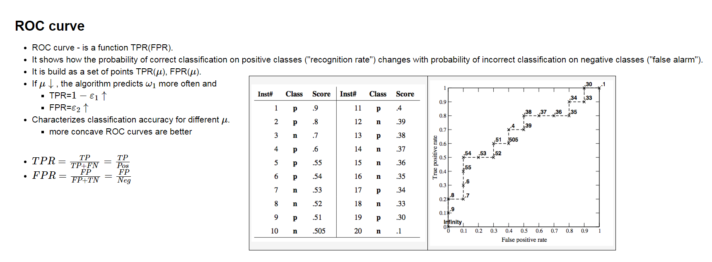
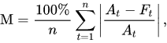
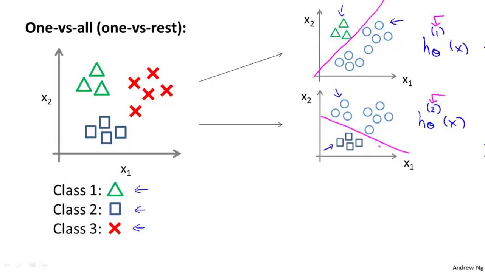
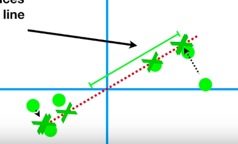
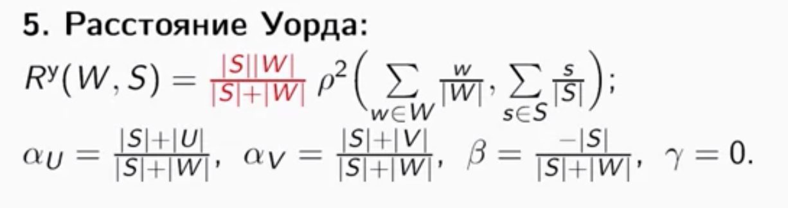
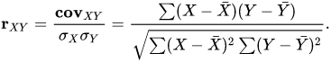

# АНДАН 2K!9

IDIOT-PROOF EDITION

Авторы: 

- :sunglasses: Даниил Крайнов
- :metal: Алексей Горбачев

Основная цель репы - описать все вещи настолько простыми словами, насколько возможно.

Билеты: [https://github.com/shestakoff/hse_se_ml/blob/master/2019/exam/exam.pdf](https://github.com/shestakoff/hse_se_ml/blob/master/2019/exam/exam.pdf) 

*"Ёбаный рот этого казино блять"*

*- Альберт Эйнштейн после того,*

*как он вытянул вопрос про PCA,*

*2019 г. до н.э.*

# Theoretical minimum

## 1. Discriminant functions. Write out discriminant functions for multiclass linear classifier and K-NN.

## 2. Describe model evaluation with train/test sets, cross validation and leave-one-out techniques. Overfitting and underfitting.

**Разделение на train/test**: известна целевая переменная, на train модель обучается, на test - проверяется. Как проверяется: fit на train, 

y_pred = predict на test, проверяем точность, сравнивая y_pred и y_test (настоящих целевых переменных в test-датасете). Есть еще validation set, там гиперпараметры тюнить и смотреть, чтоб оверфита не было, перед test. Обычно делят train/test как 70/30 или 80/20.

**Cross validation** - делим весь датасет на K кусков. На (K-1) кусков обучаем модель, на последнем - тестируем (**K-fold**). Повторяем для каждого куска, чтобы он 1 раз использовался как тестовый сет, а К-1 раз - как часть тренировочного. Во время каждых из К тренировок/тестирований замеряем accuracy_score, потом смотрим, например, среднее у всех этих accuracy_score.

Leave-one-out - вариация CV, в которой K = N, где N - количество наблюдений. То есть, каждое наблюдение в датасете один раз используется как тестовый датасет, а остальные (N-1) раз - как часть тренировочного. Соответственно, это N-fold CV.

Есть еще stratified CV, где куски делятся так, что в каждом есть определенная пропорция по классам.

Overfitting - когда получившаяся модель слишком сильно подогнана под тренировочный датасет, например, из-за использования при подгонке большого количества разных признаков, или если модель принимает во внимание noise, а в реальных данных его нет. Модель будет очень точно предсказывать целевую переменную для данных в train-датасете, но ошибаться в настоящем.

Underfitting - когда получившаяся модель слишком простая, не улавливает "тренды" в данных, антоним overfitting. Например, модель выводит линейную зависимость, а на деле она нелинейная.

Чё почитать:

* [https://towardsdatascience.com/train-test-split-and-cross-validation-in-python-80b61beca4b6](https://towardsdatascience.com/train-test-split-and-cross-validation-in-python-80b61beca4b6)

##  3. What is one-hot encoding? Give feature normalization methods. Why all these feature transformations are important?

One-hot encoding: когда у вас есть признаки, обозначающие качественные переменные, и их нужно как-то преобразовать, чтобы модель скушала. Просто присвоить каждому различному объекту признака (Label Encoding) [France, Germany, Spain] число [0, 1, 2] нельзя - модель может подумать, что 0 < 1 < 2 - Испания лучше Франции, а оно не должно быть так. Поэтому каждый объект признака становится отдельным признаком каждого сэмпла в датасете. То есть, появляется три новых колонки - France, Germany, Spain. Для каждой колонки: если у сэмпла признак равен названию колонки, то ставится 1, иначе 0.

<table>
  <tr>
    <td>№</td>
    <td>Country</td>
    <td>Var2</td>
    <td>Y</td>
    <td></td>
    <td>№</td>
    <td>France</td>
    <td>Germany</td>
    <td>Spain</td>
    <td>Var2</td>
    <td>Y</td>
  </tr>
  <tr>
    <td>1</td>
    <td>France</td>
    <td>146</td>
    <td>1</td>
    <td></td>
    <td>1</td>
    <td>1</td>
    <td>0</td>
    <td>0</td>
    <td>146</td>
    <td>1</td>
  </tr>
  <tr>
    <td>2</td>
    <td>Germany</td>
    <td>572</td>
    <td>0</td>
    <td>==></td>
    <td>2</td>
    <td>0</td>
    <td>1</td>
    <td>0</td>
    <td>572</td>
    <td>0</td>
  </tr>
  <tr>
    <td>3</td>
    <td>Spain</td>
    <td>311</td>
    <td>0</td>
    <td></td>
    <td>3</td>
    <td>0</td>
    <td>0</td>
    <td>1</td>
    <td>311</td>
    <td>0</td>
  </tr>
  <tr>
    <td>4</td>
    <td>France</td>
    <td>400</td>
    <td>1</td>
    <td></td>
    <td>4</td>
    <td>1</td>
    <td>0</td>
    <td>0</td>
    <td>400</td>
    <td>1</td>
  </tr>
</table>

Теперь модель может сделать нормальные предположения, правда, признаков стало гораздо больше ⇒ curse of dimensionality.

Feature scaling/normalization: подгонка признаков под определенный интервал (масштаб) для улучшения работы модели.

Подгонка под [0,1]:   

Mean normalization: подгонка под [-1, 1] со средним 0: 

Feature standartization (Z-score normalization): подгонка признаков под нормальное распределение N(0, 1): среднее столбца признака будет 0, stdev = 1: 

Есть еще нормирование векторов: 

Почему важно: могут быть разные единицы измерения в разных признаках датасета, и из-за этого модель может факапить. Например, посмотрим на таблицу из вопроса 2. После энкодинга мы замечаем, что Var2 не соответствует по масштабу остальным признакам, и модель может подумать, что Var2 важнее их, что может не являться правдой.

Или один из признаков - цена чего-либо в йенах, другой - цена чего-либо в долларах, при том, что доллар - это 100 йен. Нам нужно сделать так, чтобы изменение и того, и другого признака на 1 трактовалось нормально.

##  4. Give definition (of) discriminant functions. Discriminant function for K-NN, linear models and decision tree? 

См. [Theoretical minimum #1](#heading=h.iagag5jvtcr9) для KNN/linear.

##  5. L1 and L2 regularizations. Reasons to use them.

Регуляризация - процесс добавления дополнительной информации/штрафа к функции потерь регрессионных моделей в целях предотвращения оверфиттинга.

L1 (Lasso): 

Слева от + - стандартная MSE функция потерь, справа - regularization term (LT):

Yi - настоящая Y

Xij - настоящие Х

B - коэффициенты регрессии

λ - параметр регуляризации. Если он равен нулю, остаётся оригинальная функция потерь (с потенциальным оверфитом), если слишком большой - будет underfitting.

Как работает: выше параметр ⇒ больше LT ⇒ больше функция потерь ⇒ штраф для слишком высоких коэффициентов (весов) ⇒ меньше оверфит

L2 (Ridge):

Разница: L1 - sum(abs(Bi)), L2 - sum((Bi)^2)

Почему L1 включает в себя embedded feature selection: abs(B1) + abs(B2) даёт меньший регион на графике, чем (B1)^2+(B2)^2

Чё почитать:

* [https://towardsdatascience.com/common-loss-functions-in-machine-learning-46af0ffc4d23](https://towardsdatascience.com/common-loss-functions-in-machine-learning-46af0ffc4d23)

* [https://medium.com/datadriveninvestor/l1-l2-regularization-7f1b4fe948f2](https://medium.com/datadriveninvestor/l1-l2-regularization-7f1b4fe948f2)

* [https://towardsdatascience.com/l1-and-l2-regularization-methods-ce25e7fc831c](https://towardsdatascience.com/l1-and-l2-regularization-methods-ce25e7fc831c)

##  6. What is multicollinearity? What is a dummy variable trap?

Мультиколлинеарность - наличие линейной зависимости между какими-либо объясняющими переменными в регрессионной модели. Иными словами, можно предсказать значение одного из признаков, зная некоторые другие, притом можно предсказать точно (полная коллинеарность), либо просто будет очень сильная корреляция (мультиколлинеарность).

Фиктивные переменные (dummy variables) - признаки, получаемые в ходе one-hot энкодинга и обозначающие наличие или отсутствие какого-либо качества у данного сэмпла (принимают значение 0 или 1). Например, в примере из п. 2 dummy variables - это France, Germany, Spain.

Различают full dummy coding и просто dummy coding. Full dummy - это традиционный OHE, когда создаётся N новых колонок согласно N различным категориям. Проблема full-метода в том, что в нем присутствует мультиколлинеарность: если мы знаем, что есть три категории - А, В и С, при этом сэмпл не принадлежит ни А, ни В, то мы гарантированно можем сказать, что это категория С, и нам не нужна еще одна колонка, чтобы это понять. Dummy coding создаёт не N, а N-1 колонок, чтобы получить линейную независимость этих колонок.

Dummy variable trap - это когда в результате one-hot или по какой-либо другой причине получается такой набор dummy variables, что из нескольких DV можно предсказать одну из них - получается мультиколлинеарность/избыточность. Например, была колонка Gender, в ней "Male"/"Female". Произвели one-hot - получилось две колонки Male/Female. Однако зачем нам две колонки, если из одной можно предсказать другую? Если male = 1, то гарантированно будет female = 0, и наоборот. Это может попортить точность модели, решение - дропнуть одну из колонок, чтобы была линейная независимость.

##  7. Give definition of gradient descent and stochastic gradient descent. Motivation for stochastic gradient.

Градиентный спуск - метод минимизации функции потерь, то есть получения настолько низких ошибок, насколько возможно.

Как работает: у нас есть данные (X1, Y1), (X2, Y2), …

Предположим, что наша модель y=kx+b (пусть будет один предиктор, это не принципиально). У нас есть функция потерь , где h0 - это и есть модель y=kx+b.

Возьмем две производные (по k и по b) от функции потерь, предварительно вычислив свободные члены путем подставления всех данных в функцию (k и b мы еще не знаем, они останутся). У нас получится градиент.

Возьмём рандомные значения для k и b (0 и 1). Подставим их в градиент (0 - в d/d_intercept, 1 - в d/d_slope).

Подставим эти значения в подсчёт шага, который нам нужно совершить, чтобы уменьшить функцию потерь (Learning Rate (Gamma) - гиперпараметр).

Напомню, что наши начальные значения k и b - 0 и 1. Теперь их надо заменить: уменьшить их на шаг: k -= -0.008, b -= -0.016. Теперь наша модель y = 1.008*x+0.016.

Повторяем: а) подстановку k и b в производные, б) подсчёт шага, в) изменение k и b на шаг, пока шаги не станут слишком маленькими (обычно 0.001). Финальные k и b и будут частью готовой модели y=kx+b.

Для большего количества признаков придётся вычислить больше производных. (d/d_k1, d/d_k2, d/d_k3 ⇐ y=k1x+k2x+k3x…). Поскольку это слишком сильная вычислительная нагрузка, ГС будет очень медленным на больших выборках с большим кол-вом признаков.

Стохастический градиентный спуск - такой же спуск, только производные считаются не для всех сэмплов в выборке, а только для одного случайного на каждой итерации. Т.е.:

* выбираем сэмпл;

* берем с ним градиент (кучу производных) от функции потерь;

* подставляем рандомные k1, k2, …

* считаем градиент, подставляем в функцию подсчёта шага (см. Step 4 на картинке выше)

* прибавляем шаг к k1, k2, …

* выбираем другой сэмпл, считаем производную с ним, подставляем уже текущие k1, k2, ... , и так пока не станет слишком мелкий шаг.

 

Чё посмотреть:

* [https://www.youtube.com/watch?v=sDv4f4s2SB8](https://www.youtube.com/watch?v=sDv4f4s2SB8)

##  8. Definition of confusion matrix in binary classification. How to calculate precision and recall? What is an F-measure?

Бинарная, двоичная классификация - задача разделения сэмплов на две группы.

Матрица несоответствия/неточностей показывает, как модель классифицирует те или иные объекты (примеры для бинарной классификации, хотя кол-во классов неограничено):

Precision, точность - количество сэмплов, верно отмеченных как принадлежащих определенному классу, в отношении ко всем сэмплам, отмеченным как принадлежащим определенному классу.

Precision = (#True Positive)/(#True Positive + #False Positive).

Recall, полнота - количество сэмплов, верно отмеченных как принадлежащих определенному классу, в отношении ко всем сэмплам выборки, принадлежащим определенному классу (втч тем, которые модель ошибочно отметила как не принадлежащие).

Recall = (#True Positive)/(#True Positive + #False Negative).

F-score - trade-off (гармоническое среднее) между полнотой и точностью:  

У какой модели выше F-мера - та и круче, в принципе. Можно также, если хочется, отдать приоритет либо полноте, либо точности: ,

где если 0 < B < 1, то приоритет отдается точности, а если B > 1 - то полноте.

##  9. Definition of ROC curve and AUC. Motivation for them.

ROC-кривая - график, позволяющий оценить качество бинарной классификации. Y-axis: True Positive Rate - пропорция сэмплов, верно отмеченных как принадлежащих классу, в отношении ко всем сэмплам класса. X-axis: False Positive Rate - вероятность неправильно присвоить класс сэмплу.

AUC - площадь между ROC и осью X (FPR). Больше - лучше. AUC=1 - идеал, AUC=0.5 - то же самое, что бросить монетку.

## 10. How can you measure model quality for regression task? Write down the definition of RMSE, MAE, MAPE, RMSLE.

Можно обратиться к функциям потерь. Самая часто используемая - Mean Square Error:, где Yi - настоящая целевая переменная, Yi с крышкой - предсказанная.

RMSE - Root Mean Square Error, то же самое, что и MSE, только от MSE берется корень. MSE/RMSE имеют меньшую толерантность к бОльшим отклонениям вследствие возведения отклонения в квадрат.

MAE - Mean Absolute Error. Как MSE, только вместо возведения в квадрат - взятие модуля.

MAPE - Mean Absolute Percentage Error. где At - настоящая целевая переменная, Ft - предсказанная.

RMSLE - Root Mean Squared Logarithmic Error. Как RMSE, только в квадрат берется разность не самих значений, а логарифмы их сумм с единицами. Используется, чтобы штраф не был огромным, если числа большие.

Просто формулы:

* RMSE - Среднеквадратичная ошибка

* MAE - Средний модуль отклонения

* MAPE - Средний процент отклонения

* RMSLE - Среднеквадратичное логарифмическое отклонение

## 11. Give intuition behind SVM. Write an optimization problem for linearly separable SVM.

SVM - Support Vector Machines, метод опорных векторов. Используется для задач классификации и регрессии. Суть - в выводе гиперплоскости, разделяющей сэмплы по классам. Гиперплоскость есть плоскость размерности на одну единицу меньше, чем пространство, её содержащее (на плоскости, например, в декартовой системе координат, гиперплоскость есть прямая линия; в 3D - плоскость).

 - уравнение гиперплоскости, где w - вектор, перпендикулярный к гиперплоскости, b - bias, - расстояние от гиперплоскости до начала координат. Задача SVM - найти такую гиперплоскость, чтобы расстояние (margin) от нее до ближайших точек двух разных классов было наибольшим. Собственно опорные вектора - те сэмплы, которые находятся ближе всего к гиперплоскости и которые регулируют ее положение, наклон и т.д.

Как происходит классификация: 

 Это гиперплоскости, параллельные оптимальной (на рисунке пунктиром). Если подставить в уравнение гиперплоскости x и посчитать его, результат >1 будет означать, что сэмпл принадлежит одному классу, а <-1 - другому. 

Ширина полосы между пунктирами - , задача - минимизировать . 

##### 

-Здесь w0 - это b.

W0 это не b, b = 1

Че почитать:

* [http://web.mit.edu/6.034/wwwbob/svm-notes-long-08.pdf](http://web.mit.edu/6.034/wwwbob/svm-notes-long-08.pdf)

* [https://towardsdatascience.com/support-vector-machine-introduction-to-machine-learning-algorithms-934a444fca47](https://towardsdatascience.com/support-vector-machine-introduction-to-machine-learning-algorithms-934a444fca47)

##  

## 12. Kernel trick. How does it work for K-NN and for SVM?

Kernel trick - метод работы с линейно НЕсепарабельными классами, то есть на примере SVM это те классы, которые нельзя полностью разделить, проведя прямую. Суть метода - использование кернелов - ядер - для переноса сэмплов в более высокое измерение, где составить гиперплоскость уже не составит труда.

Как работает для KNN: 

    Считаем расстояние между соседями через функцию ядра. 

Судя по лекции Шестакова №2, вот любые из этих функций можно пропихнуть в KNeighborsClassifier как параметр weights:

def gauss_kernel(d, h=h):

        return np.exp(-(d**2)/(2*h**2))

knn = KNeighborsClassifier(n_neighbors=k, metric='minkowski', p=2, weights=gauss_kernel)

Как работает для SVM:

    Скалярное произведения заменяем на функцию ядра

Чё посмотреть:

* [https://www.youtube.com/watch?v=vMmG_7JcfIc](https://www.youtube.com/watch?v=vMmG_7JcfIc)

## 13. Multiclass classification with binary classifiers: one-vs-all and one-vs-one schemes.

Мультиклассовая классификация - задача классификации сэмплов по трем и более классам, в отличие от бинарной (по двум). Данный тип классификации можно имплементировать с помощью бинарных классификаторов (SVM/logreg/…) по двум схемам:

* One-vs-all / one-vs-rest

Это когда из выборки со многими классами для каждого классификатора какой-то конкретный класс (one) отмечается как правильный, а все остальные (all) - как неправильные.

То есть, один классификатор натренирован на треугольники, другой - на крестики (третий в данном случае лишний).

Затем схема такая:

    S = сэмпл

    Classifier1.predict(S) == Class 1?

        Да ⇒ закончили, это треугольник

        Нет ⇒ Classifier2.predict(S) == Class 2?

            Да ⇒ закончили, это крестик

            Нет ⇒ закончили, это квадрат

Проще говоря, хотя бы один классификатор, натренированный на класс сэмпла, нам точно скажет, что это он.

* One-vs-one

У нас есть множество классов (A, B, C) (в общем случае N). Для каждой пары из множества мы тренируем бинарный классификатор, используя то подмножество сэмплов, которое содержит эти классы:

    A/B

    B/C

    C/A

В итоге в общем случае получаем (N-1)+(N-2)+...+1 = N*(N-1)/2 классификаторов

Затем для каждого тестового сэмпла мы пробегаемся по всем этим классификаторам. Допустим, у нас есть сэмпл  из класса В:

    Классификатор A/B выдаст В

    Классификатор B/C выдаст В

    Классификатор C/A выдаст С (допустим; он же должен ведь что-то выдать)

Смотрим на это голосование и видим, что за В отдано больше голосов. Значит, классифицируем как В.

## 14. What is feature selection? Why is it useful? Describe types of feature selection procedures.

Feature selection - процесс выбора наиболее важных для работы модели признаков.

Полезен потому, что может предотвратить оверфит (больше фич - больше подгонка под них - хреново); уменьшить время тренировки, увеличить точность и простоту понимания.

Типы: метод фильтров, метод обертывания, embedded. Подробнее - [Detailed questions #1.1](#heading=h.1kde15gg1ufo).

Примеры методов:

* матрица корреляции, в частности - корреляция между каждым признаком и целевой переменной (univariate selection). Это относится к методу фильтров.

* feature importances

Используется в решающих деревьях: при каждом разделении смотрим, насколько уменьшилась энтропия/увеличился information gain (проще говоря, насколько хорошо данная фича делит выборку на две). Чем больше information gain - тем больше importance у данной фичи. Это относится к embedded-методу.

* L1-регуляризация. Embedded-метод.

## 15. Bias-Variance decomposition of error.

Bias - смещение. Тип ошибки, когда модель слишком простая и не может поймать тренд в данных. Разница между настоящей переменной и предсказанной.

High bias, low variance == андерфит.

Variance - дисперсия. Тип ошибки, когда модель слишком чувствительна к отклонениям в выборке. Большая дисперсия - кривая туда-сюда пляшет, экстремумы линии далеко от центровой/средней линии. То есть смещения (разницы между настоящими и предсказанными данными) почти нет.

Low bias, high variance == оверфит.

Декомпозиция ошибки:

Irreducible Error - неустранимая погрешность, шум в датасете. E(x) - матожидание.

## 16. Describe PCA algorithm learning process.

PCA, Principal Component Analysis - метод главных компонент.

Допустим есть какие-то вхождения в датасет. Мы можем посчитать корреляцию между некоторыми фичами, и заметить что это позволяет нам разбить датасет на кластеры. Но что если этих фичей много? Считать корреляцию между каждыми парами фичей и строить кучу двумерных графиков плохая затея. Можно также построить многомерный график корреляции фичей, что тоже совсем не гуд.

Выход есть - PCA

PCA - уменьшает размерность фичей, оставляя главные компоненты, который аггрегируют в себе корелляцию различных фичей между друг другом. 1 компонента самая важная, и показывает наиболее сильное отличие между кластерами, 2 не такая важная и т.д.

Цель - уменьшить размерность с 4 и более фичей до, например, 2х, чтобы можно было легко делить на кластеры, основываясь на расстоянии между центрами кластеров и сэмплом.

Шаги:

1. Считаем средние значения всех фичей

2. Смещаем датасет, чтобы средние значения фичей были 0

X - средние значения фичей

3. Заводим прямую и вращаем ее так, чтобы проекции точек из датасета на нее были максимально удалены от центра координат, или же чтобы расстояние точки прямой было минимальным, что равносильно по теореме пифагора Ы

4. Эта прямая и проекции точек на нее являются первой компонентой, можно посмотреть, какое влияние оказывают различные фичи на эту компоненту, посмотреть на коэффициенты прямой. На картинке выше на одну единицу фичи2 приходится четыре фичи1.  

5. Добавляем вторую прямую, перпендикулярную первой и получаем 2 компоненты. В датасете это будет выглядеть как 2 колонки, в которой лежат расстояния проекций точек на компоненты до центра координат 

В случае, когда фичей больше чем 2, просто при добавлении новой компоненты нужно ее так же вращать вдоль предыдущей прямой, чтобы максимизировать расстояния до центра координат. Последняя компонента всегда является перпендикулярной предыдущим и ее не надо вращать никуда.

Математически:

1. Ищем ковариационную матрицу смещенных фичей

2. Находим собственные вектора

3. Они являются компонентами

Собственные вектора можно найти с помощью СВД, а именно с помощью левой сингулярной матрицы

Че посмотреть:

* [https://www.youtube.com/watch?v=HMOI_lkzW08](https://www.youtube.com/watch?v=HMOI_lkzW08) - главные идеи за 5 минут

* [https://www.youtube.com/watch?v=FgakZw6K1QQ](https://www.youtube.com/watch?v=FgakZw6K1QQ) - подробнее 20 минут

## 17. Difference between lemmatization and stemming.

Лемматизация - процесс приведения слова к нормальной (словарной) форме. Для русского языка - именительный падеж, единственное число. Кошками ⇒ кошка. Обычно это просто поиск по словарю.

Стемминг - процесс нахождения основы слова. Для русского - слово без окончания и формообразующих суффиксов, с исключениями. Алгоритмы могут включать в себя простой поиск по таблице, усечение окончаний/приставок.

## 18. Bag of words and TF-IDF representation of texts.

Bag of words - модель представления текста в виде отдельных слов, без учета грамматики, но с учетом числа появления данного слова в тексте. Пример:

    S1: I like birds. I also like cats.

    BOW(S1): {"I":2, "like":2, "birds":1, "also":1, "cats":1}

Числа - частота появления слова в тексте.

Теперь можно использовать BOW(S1) для превращения текстов в вектора, которые уже может кушать модель. У нас есть слова "I", "like", "birds", "also", "cats".

У нас есть предложение: "I have three cats". Для каждого слова в предложении будем смотреть, есть ли оно в BOW. Если есть, ставим 1, если нет - 0.

"I have three cats" ⇒ [1, 0, 0, 1]. Теперь можно че-то делать.

TF-IDF - мера оценки важности слова в тексте. TF = Term Frequency, частота слова. IDF = Inverse Document Frequency, обратная частота документа.

TF = отношение числа вхождений слова в текст к общему числу слов в тексте. TF("I", "I like cats") = 0.33

IDF = log(общее число текстов/число текстов, в которых встречается термин). IDF("I", ["I like cats", "Cats are good"]) = log(2/1) = log(2) = 0.69

TF-IDF = TF * IDF. TF("I") = 0.33 * 0.5 = 0.228

## 19. Definition of neuron in feedforward neural networks.

Feedforward NN - нейронка, где нет циклов.

Нейрон - единичный юнит нейронки. Это по сути функция, принимающая на вход значения других нейронов, умножающая их на соответствующие весы, добавляющая bias и прогоняющая результат через функцию активации (напр. logistic). Это и будет выход нейрона.

## 20. Describe backpropagation algorithm for NN.

Backpropagation, обратное распространение - алгоритм обучения нейронок, использующий градиентный спуск. [(Суть в том, что мы обнаруживаем что на выходе не то, что должно быть, и начинаем переводить стрелки и искать кто виноват в неправильном результате. Попутно давая по шапке нейронам(меняя весовые коэффициенты). А эти нейроны дают по шапке предыдущим. и так до первого слоя.)](https://docs.google.com/document/d/1ebZUttizUiQkfBwudVvbQNi6T2NUYPZ12wDTxI7RiAI/edit#)

Собственно, делаем то же самое, что и при обычном спуске, только подставляем теперь веса и biases для всех нейронов.

## 21. Structure of conv-NN. Conv filters and their settings.

Сверточные нейронные сети - вид НН, в основном предназначенный для распознавания образов. На вход подается изображение, причем разделенное по RGB (depth). В ConvNet есть разные типы слоев:

* Convolutional layer, слой свертки - ядро свертки пробегается по инпуту, считает матричное произведение. 

Тут видно, что ядра тоже трехмерные. Итоговый convoluted слой имеет глубину 1, исходное изображение - 3 (RGB).

* Pooling layer, слой пулинга - уплотнение, даунсэмплинг, чтобы модель работала быстрее, при этом основные фичи изображения остались.

[There are two types of Pooling: Max Pooling and Average Pooling. Max Pooling returns the maximum value from the portion of the image covered by the Kernel. On the other hand, Average Pooling returns the average of all the values from the portion of the image covered by the Kernel.](https://towardsdatascience.com/a-comprehensive-guide-to-convolutional-neural-networks-the-eli5-way-3bd2b1164a53)

* Fully-connected layer - полносвязный слой - классификация. Матрица конвертится в вектор, он скармливается multi-layer feedforward сетке.

    Фильтры - это то, что скользит по инпуту на слое свертки.

Пример фильтра.

Чё почитать:

* [https://adeshpande3.github.io/A-Beginner%27s-Guide-To-Understanding-Convolutional-Neural-Networks/](https://adeshpande3.github.io/A-Beginner%27s-Guide-To-Understanding-Convolutional-Neural-Networks/)

## 22. How to measure quality of clustering with rand index?

Кластеринг - процесс распихивания объектов по однородным группам. Как классификация, только классы нужно придумывать самим.

Rand index - метод сравнения "похожести" двух разбиений одного и того же датасета на кластеры:      

Где:

    S - исходный датасет, который надо поделить на кластеры;

    X - разбиение на кластеры 1;

    Y - разбиение на кластеры 2;

    a - количество пар элементов в S, которые (элементы) находятся в одном кластере в X и в одном кластере в Y;

    b - количество пар элементов в S, которые (элементы) находятся в разных кластерах в X и в разных кластерах в Y.

Пример: S = {a, b, c, d, e, f};

X: {1, 1, 2, 2, 3, 3} - разбиение S на три кластера, a и b в №1, c и d в №2, e и f в №3.

Y: {1, 1, 1, 2, 2, 2}.

Все пары элементов в S: {a, b}, {a, c}, {a, d}, {a, e}, {a, f}, {b, c}, {b, d}, {b, e}, {b, f}, {c, d}, {c, e}, {c, f}, {d, e}, {d, f}, {e, f} - всего 15 штук (это (N 2) в формуле)

Для каждой пары смотрим: если первый элемент пары в одном кластере, второй в том же самом, причем это выполняется и для X, и для Y - увеличиваем a в формуле на 1. Если оба элемента пары в разных кластерах и в X, и в Y, увеличиваем b в формуле на 1. 

Складываем a и b и делим на 15 - получим RI.

## 23. Describe K-means algorithm.

K-means - алгорифм кластеринга. K - потому что количество кластеров, К, мы задаём заранее.

1. Начальные центроиды кластеров обычно берутся рандомно.

2. Затем для каждого сэмпла датасета считаются K расстояний до K центроидов. 

3. Сэмплу присваивается класс в зависимости от того центроида, к которому он получается ближе всего.

4. Происходит перерасчет центроидов: берем среднее от всех сэмплов кластера, назначаем центроид как это среднее.

5. Повторяем алгорифм с шага 2 до тех пор, пока у нас не будет слишком мелкое движение центроидов в сравнении с их предыдущей позицией, либо просто останавливаем его после N итераций.

## 24. Describe agglomerative clustering algorithm.

Агломеративный кластеринг (АК) - подвид иерархического кластеринга (то есть когда у нас строится "иерархия" кластеров, аки дерево). Это bottom-up подвид, top-down - это divisive кластеринг, там в самом начале все сэмплы в одном кластере, затем они делятся.

АК:

1. все сэмплы раскиданы по собственным кластерам, то есть в каждом кластере - один сэмпл.

2. выбираем метрику, служащую расстоянием между двумя кластерами, например, Евклидову или Манхэттенскую: (Евклидова)

(Манхэттенская)

3. на каждом шаге комбинируем два каких-либо кластера, у которых расстояние между ними минимальное

4. повторяем шаг 3 до тех пор, пока не останется нужное нам количество кластеров

5. Расстояния между кластерами рассчитывается по формуле Уорда (взвешенное по мощностям кластеров расстояние между центрами масс).

## 25. What is ensemble learning? Bagging

Ensemble learning, ансамбль методов - метод машинного обучения, при котором используется несколько более слабых алгоритмов, затем результат их работы комбинируется, чтобы дать результат получше.

Обучение ансамблями включает в себя несколько вариаций.

(Note: with replacement - с повторением: [a, b, c] ⇒ (a, a), (a, b), …; without replacement - без повторений: [a, b, c] ⇒ (a, b), (b, c), …)

Bagging/bootstrap aggregating - такой метод, когда наши классификаторы (или другие модели) тренируются на подмножествах исходной выборки с повторениями. То есть, один сэмпл может оказаться в нескольких подмножествах для разных моделей.

Затем, во время фазы предсказания, сэмплы, для которых мы хотим узнать класс (или числовое значение, в случае регрессионных деревьев), передаются во все модели.

Допустим, есть сэмпл X. Модель A показала, что он принадлежит классу 1, модель В - классу 2, модель С - 3, модель D - 1. Путем подсчета голосов присваиваем сэмплу Х класс 1. В случае регрессионных деревьев - то же самое, только мы не голосуем, а берем среднее от результатов предсказаний.

## 26. What is ensemble learning? Random Forest

Определение ensemble learning - в [билете 25](#heading=h.3p3tglclh7dn).

Random Forest - подвид бэггинга, использующий decision trees в качестве моделей. Отличие от обычного бэггинга в том, что на каждом новом сплите в каждом дереве выбор того признака, по которому будет идти сплит, выбирается из случайного подмножества всех признаков. Это делается потому, что если дать возможность деревьям выбирать лучший признак из всех возможных, то все деревья на соответствующих сплитах будут выбирать одни и те же признаки, по сути уничтожая саму необходимость в нескольких деревьях.

## 27. What is ensemble learning? Gradient Boosting

Определение ensemble learning - в [билете 25](#heading=h.3p3tglclh7dn).

Boosting в контексте ансамбля - это когда каждая новая модель в ансамбле есть некое улучшение предыдущей. Например, мы смотрим на вывод первой модели, смотрим на ошибки, и в следующей модели мы даем больший вес (путем, например, более частого включения ошибочного сэмпла в новый датасет) при создании классификатора тем сэмплам, на которых проебался предыдущий классификатор.

Как работает Gradient Boosting:

1. Берем среднее от целевой переменной. Это будет первое дерево. То есть, каждому сэмплу будет предиктиться, что его переменная - среднее.

2. Считаем ошибки

3. Строим следующее дерево, но там вместо листьев веса - листья остатков

(Если в листе 2+ предикшна, берем их среднее (на картинке -14.7))

4. Предиктим новый вес для сэмплов датасета с учётом learning rate, чтобы избежать оверфита

5. Повторяем, начиная с шага 2, пока не будет N деревьев. При этом при новых предикшнах для тренировочного датасета мы включаем результат классификации для данного сэмпла из предыдущих деревьев, т.е. на третьем дереве будет 71.2 + 16.8 + какое-то новое значение. Не забываем learning rate.

6. Предикт на тестовых данных работает точно также: берем предикшн от первого дерева (71.2), предикшн из второго дерева, из третьего…, суммируем их - вуаля.

7. Классификация работает точно также, только там в качестве листьев и остатков используются вероятности, что сэмпл попадает в такой-то класс.

Чё посмотреть:

1. [https://www.youtube.com/watch?v=LsK-xG1cLYA](https://www.youtube.com/watch?v=LsK-xG1cLYA)

2. [https://www.youtube.com/watch?v=3CC4N4z3GJc](https://www.youtube.com/watch?v=3CC4N4z3GJc)

3. [https://www.youtube.com/watch?v=jxuNLH5dXCs](https://www.youtube.com/watch?v=jxuNLH5dXCs)

## 28. Idea of Collaborative Filtering

Коллаборативная фильтрация - метод построения прогнозов в рекомендательных системах (системы предсказания вещей, заинтересующих пользователя, по его данным), использующий известные предпочтения группы пользователей для предсказания неизвестных предпочтений другого пользователя.

Item-Item Collaborative Filtering: "Users who liked this item also liked …"

User-Item Collaborative Filtering: "Users who are similar to you also liked …"

# Short questions

## 1. Dimensionality reduction, feature selection and NLP

### 1.1. Definition of correlation and mutual information. Intuition behind them

Корреляция - мера статистической взаимосвязи между двумя и более величинами.

Взаимная информация - еще одна мера взаимосвязи, указывающая, какое количество информации мы можем узнать об одной переменной, исследуя другую переменную.

[For example, suppose X represents the roll of a fair 6-sided die, and Y represents whether the roll is even (0 if even, 1 if odd). Clearly, the value of Y tells us something about the value of X and vice versa. That is, these variables share mutual information.](https://people.cs.umass.edu/~elm/Teaching/Docs/mutInf.pdf)

Будем вышеуказанный пример с бросками костей рассматривать во время пояснения за вот эту вот формулу:

H(X) - энтропия. Пусть X обозначает информацию о том, какая из шести сторон кубика выпала, а Y - информацию о том, четное ли выпало число. Она считается так:

. Здесь p(i) - вероятность события i (для примера с кубиками - везде 1/6).

. Это энтропия совместной системы, тут P_ij - вероятность одновременно события i из системы X и j из системы Y. В случае кубиков, например, строим матрицу 6x2 и смотрим все варианты.

Считать всю систему стало лень, простите.

### 1.2. Recurrent feature elimination

Берем модель, тренируем на всех N фичах, смотрим feature importances ([№1.3](#heading=h.72iid9nbpqvg)), убираем фичу с наименьшей importance, тренируем на N-1 фичах, повторяем, пока не будет K лучших фич.

### 1.3. How is decision tree feature importance calculated?

Считаем вероятность дойти до ноды и умножаем на "impurity" - как я понял - что-то типа доли правильно угаданных объектов

### 1.4. Definition of PCA. How to perform transformations?

См. [Theoretical minimum #16](#heading=h.gr5m3oas7ngq)

Сместить фичи к центру, повернуть датасет основываясь на вектора компонентов.

### 1.5. Definition of SVD. Its connection to PCA

SVD - Single Value Decomposition, или сингулярное разложение. Это метод разложения прямоугольной матрицы на 3 компонента - U, E и V, где U и V - унитарные матрицы, а E - диагональная (т.е. такая, где элементы, не расположенные на главной диагонали, равны нулю). SVD используется для расчётов в PCA, как точно - не ебу.

Левая сингулярная матрица ковариационной матрицы смещенных фичей является векторами компонентов PCA

Чё почитать:

* [https://towardsdatascience.com/pca-and-svd-explained-with-numpy-5d13b0d2a4d8](https://towardsdatascience.com/pca-and-svd-explained-with-numpy-5d13b0d2a4d8)

    

### 1.6. What is TF-IDF? Its movitation?

См. [Theoretical minimum #18](#heading=h.ysrqorkw5kc3)

### 1.7. Connection between LSA and PCA

LSA - Latent Semantic Analysis (см. [Detailed questions #1.3](#heading=h.g2o67xahr15))

* Оба метода юзают SVD

* Честно говоря LSA это тот же самый PCA только предназначен для текстовых данных

* Он скипает часть препроцессинга и тоже делит текст на различные компоненты

## 2. Neural Networks

### 2.1. Definition of multi-layer feedforward neural network. Possible activation functions

Нейронная сеть - математическая модель, построенная по образу и подобию реальных нейронных связей в человеческом мозге и представляющая собой систему связанных между собой "нейронов" - функций/процессоров, принимающих сигналы со входа или с других нейронов, производящих вычисления над ними и выдающих либо новый сигнал, либо результат работы всей сети. Иначе говоря, нейросетки есть графы, нейроны - вершины, рёбра с весами.

В данном примере зеленые вершины - входные нейроны (input layer), принимающие на вход числа и передающие их синим нейронам.

Синие нейроны - hidden layer, они принимают числа, умножают их на вес того ребра, которое соединяет данный нейрон в слое с нейроном из прошлого слоя, от которого это число пришло, складывают все пришедшие числа*веса, добавляют число - bias, нормализуют это число с помощью функции активации и передают это число дальше. Hidden layer-ов может быть много.

Наконец, output layer - это те нейроны (желтые на картинке), которые выдают результат работы сети - либо просто число, либо, в зависимости от порога, классификацию входных данных.

Multi-layer потому, что как минимум три слоя: входной, hidden, выходной. Hidden-слоев может быть дохуя и больше.

Feedforward потому, что результаты работы нейронов передаются слева направо, нет циклов/передачи выхода нейрона на прошлые слои (в отличие от recurrent NN).

Функции активации - это функция, вычисляющая выходной сигнал нейрона. Они используются для добавления нелинейности в модель, чтобы потом интерпретация данных и аппроксимация функции, описывающей данные, лучше шла. Без функций активаций вместо нейронки мы получаем обычную линейную регрессию.

Желательные свойства, которыми должна обладать функция активации: нелинейность, непрерывная дифференцируемость (чтобы backpropagation/градиентная хуйня работала нормально), монотонность.

Примеры функций (их дохуя, тут самые популярные):

* сигмоида

* Rectified Linear Unit (ReLU)

* Tanh - гиперболический тангенс

### 2.2. Idea behind the backpropagation algorithm

См. [Theoretical minimum #20](#heading=h.ru4a3an6i7ed)

### 2.3. Why is conv-NN more preferable to simple NN for image analysis?

Структура конволюционок - см. [Theoretical minimum #21.](#heading=h.yvy8349owugv)

Если мы будем использовать стандартные нейронки для анализа изображений, это повлечет за собой как минимум две проблемы.

Первая - вычислительная. Анализ 4К-8К изображений размером в десятки миллионов пикселей будет означать охуительное число нейронов, охуительное число весов, и всё это - только один слой. Мы просто заебёмся ждать результата.

Вторая - интерпретативная. Структура конволюционных слоёв и наличие таких вещей, как ядра/фильтры, позволяет conv-нейронкам действительно выковыривать какие-то интересные фичи изображений, потому что на conv-слоях идет анализ конкретной части изображения - матрицы пикселей. В случае обычной нейронки слои будут просто смотреть на вектора пикселей и нихуя не понимать, являются ли они частью чего-то большего и интересного или нет.

## 3. Ensemble methods

### 3.1. What is bagging?

См. [Theoretical minimum #25](#heading=h.3p3tglclh7dn)

### 3.2. Describe Random Forest algorithm.

См. [Theoretical minimum #26](#heading=h.z7s1wji236r5)

### 3.3. Describe boosting. How does it differ from bagging/random forest?

См. [Theoretical minimum #27](#heading=h.56vg7hdjtjd5)

### 3.4. What is blending and stacking?

Stacking - как bagging, только вместо голосования или выбора среднего мы используем выводы N моделей, чтобы создать новую модель.

Blending - делим датасет на 2 части, учим кучу маленьких моделей на датасете, их ответы добавляем на тест и во вторую часть датасета в качестве фичей. Учим другую модель на ответах этих алгоритмов.

Чё почитать:

* [http://blog.kaggle.com/2016/12/27/a-kagglers-guide-to-model-stacking-in-practice/](http://blog.kaggle.com/2016/12/27/a-kagglers-guide-to-model-stacking-in-practice/)

## 4. Clustering

### 4.1. Agglomerative clustering. Possible distance between clusters.

См. [Theoretical minimum #24](#heading=h.2x8cq1j670sw)

### 4.2. K-Means. Possible initializations of centroids.

K-Means: см. [Theoretical minimum #23](#heading=h.zbqx23759lu)

Центроиды считаются как среднее от всех сэмплов в кластере (пример: 20, 30, 35 -> 28.3).

Методы инициализации центроидов:

* рандомное разделение датасета на K частей, рассчёт центроида для каждой части

* просто рандомный выбор K сэмплов из датасета и назначение их как центроидов

* выбор K наиболее далеких друг от друга сэмплов. Например: №1 - рандомный сэмпл, №2 - наиболее далекий от №1, №3 - наиболее далекий от №1 и №2, и т.д.

* k-means++: похож на предыдущий, но использует вероятности. Выбираем №1 рандомно, для каждого сэмпла Х из всех остальных считаем D(Х) == расстояние от Х до ближайшего уже выбранного центроида (в данном случае только №1). Затем из всех еще не выбранных выбираем один, у которого наибольшая вероятность выбора, а она пропорциональна D(X)^2 - чем больше расстояние, тем больше вероятность выбора этой точки.

А вообще выбор начальных центроидов - это NP-сложная проблема, так-то.

### 4.3. K-Means. Ways to estimate number of clusters.

K-Means: см. [Theoretical minimum #23](#heading=h.zbqx23759lu)

Однозначно охуенного алгоритма выбора количества кластеров нет, есть только эвристика.

Возможные методы:

* просто смотрим на данные (plt.scatter()) и прикидываем хуй к носу. Например, на картинке слева довольно очевидно, сколько должно быть кластеров

* Elbow method. Он основан на минимизации т.н. within-cluster sum of squares (внутрикластерной суммы квадратов): 

Здесь S_k - сэмплы в K-ом кластере, третья сумма и то, что после нее, - это сумма квадратов расстояний всех сэмплов кластера k до центроида данного кластера (центроид - x с крышкой), p - число фич в одном сэмпле. Проще говоря, для каждого кандидата-числа кластеров k от 1 до N:

1. делаем разбиение на кластеры (да, алгорифм предполагает разбиение на кластеры N раз для разного числа кластеров и уже потом выбор лучшего разбиения)

2. для каждого кластера в текущем разбиении считаем сумму квадратов расстояний каждого сэмпла кластера, считаем сумму Y этих сумм у всех кластеров текущего разбиения, заносим сумму на график: x = k (текущее число кластеров), y = Y.

3. смотрим на график:

По сути, мы строим зависимость общей дисперсии разбиения от кол-ва кластеров. Здесь важен баланс: если кластеров будет слишком много, получим оверфит, слишком мало - будет охуительно большая дисперсия. Поэтому мы выбираем такое число, после увеличения которого мы не получим СУЩЕСТВЕННО лучшего разбиения. На графике, например, это 4.

* Average silhouette method

Аналогичный предыдущему метод, только в качестве метрики качества мы вместо суммы квадратов берем т.н. силуэты - числовые значения от -1 до 1, характеризующие скученность и разделённость кластеров (больше - лучше). Как считать: для каждой точки i в каждом кластере Ci рассчитываем: 

a(i) - среднее расстояние между i и остальными точками кластера; 

b(i) - минимальное (т.е. рассчитывается относительно ближайшего кластера, в котором i не состоит) среднее расстояние от i до всех точек других кластеров;

s(i) - силуэт точки.

.

Берем среднее от силуэтов всех точек датасета, строим график, всё как в прошлом методе.

* Gap statistic

[https://datasciencelab.wordpress.com/tag/gap-statistic/](https://datasciencelab.wordpress.com/tag/gap-statistic/)

### 4.4. DBSCAN. Pitfalls of the method.

DBSCAN (Density-based spatial clustering of applications with noise) - еще один алгорифм кластеринга. Density-based == кластеры определяются как места на графике с большей плотностью точек, чем остальные места (являющиеся шумом). Гиперпараметры алгоритма: Е - окрестность вокруг основной точки кластера, все точки в окрестности будут считаться частью кластера; minPts - минимальное количество точек в одной окрестности, которые образуют кластер. В качестве метрики расстояния обычно используется Евклидово.

Как работает:

1.  Для каждой точки P: 

    1. если точка уже отмечена как шум/часть кластера, пропускаем её.

    2. в датасете находим её соседей (множество S) в  окрестности. Если количество соседей на расстоянии <= E меньше, чем minPts, данная точка помечается как шум (хотя дальше она может быть помечена как часть другого кластера).

    3. создаём кластер, точку помечаем как принадлежащую кластеру.

    4. для каждой точки в множестве S, пока оно не пустое (может пополниться внутри этого цикла):

        1. если ранее эта точка была помечена как шум (например, её проверили до P и там соседей было недостаточно много), отмечаем её вместо этого как часть кластера.

        2. если точка до сих пор никак не помечена (шум/кластер), отмечаем её как часть кластера.

        3. смотрим соседей этой точки, как в пункте b. Если число соседей больше или равно minPts, то заносим их всех в S, чтобы потом тоже проверить с возможным внесением в кластер.

Преимущества:

* алгорифм может найти линейно неразделимые кластеры

* устойчив к шуму

* всего два гиперпараметра

* не нужно заранее указывать, сколько нужно кластеров - DBSCAN сам вычислит их число

Недостатки:

* краевые точки между двумя кластерами могут быть отмечены как часть любого из них, это зависит от порядка просмотра точек

* евклидова метрика, равно как и человек, задающий параметр Е, могут захлебнуться на данных высокой размерности

* если разница в плотности в разных областях датасета большая, то результаты кластеризации становятся хуже.

### 4.5. Cluster quality and validity measures.

См. [4.3](#heading=h.2mctltkt2gry) - на глаз, elbow, силуэты. Есть еще такая вещь, как [Dunn Index](https://www.datanovia.com/en/lessons/cluster-validation-statistics-must-know-methods/#dunn-index), но я, если честно, уже заебался, поэтому пусть кто-нибудь другой его разберет.

## 5. Recommender systems

### 5.1. RecSys idea and challenges.

Рекомендательные системы (РС) - модели, которые пытаются предсказать, какие объекты могут понравиться пользователю, имея какую-либо информацию о нем, либо о других пользователях. Есть два основных типа РС:

* content-based: рекомендации создаются на основе прошлого опыта пользователя. Например, есть датасет различной музыки, у каждого трека - фичи аки в стандартных данных. Пользователь слушает музыку и явно/неявно её оценивает (рейтинг или просто количество прослушиваний). На основании оценивания система некоторым атрибутам треков придаёт меньшее/большее значение и уже отталкивается от этого при дальнейшей рекомендации, например, подсовывает музыку с более похожими фичами.

* collaborative filtering (коллаборативная фильтрация): см. [Theoretical minimum #28](#heading=h.e552jhrgx4g3).

Main assumption of collaborative filtering: if a person A has the same opinion as a person B on an issue, A is more likely to have B's opinion on a dierent issue. 

Challenges:

* Что делать с новыми пользователями, о которых вообще ничего не известно? Что им предлагать?

* То же самое, только с новыми предметами.

* Пользователи могут быть непоследовательными в своих оценках. Можно оценить первый сезон сериала на 5/5, второй - на 1/5. И что теперь делать?

* Более того, вместо пользователя может быть не человек, а бот, который намеренно ставит высокие оценки одним авторам и низкие - другим. Тут надо мониторить поведение, хотя в целом эта проблема меньше относится к контексту РС.

* Разреженность/огромная размерность данных: у нас есть миллион товаров и миллион пользователей. Каждый пользователь не станет оецнивать каждый из миллиона товаров (да что уж там, я сам ни разу ни одного приложения не оценил). В результате мало того, что у нас невероятно большая таблица, на анализ которой уйдет много вычислительных мощностей, так там еще и 99.9% значений - нули. Что делать? (ответ: снижение размерности).

### 5.2. Baseline predictions. Motivation.

### 5.3. User-based collaborative filtering.

Вкратце - если есть два человека с похожими вкусами (им нравятся одни и те же фильмы, например), и если одному из них понравился какой-то новый фильм, то этот же фильм можно порекомендовать и второму человеку.

Фильтрация в этом методе основана на методе Nearest Neighbors:

* находим К ближайших соседей текущего юзера

* считаем предикшн:

Здесь R_ui - финальный предполагаемый рейтинг предмета (i) юзером (u), R_u - как я понял, средний рейтинг всех вещей, проставленных данным юзером, S_uv - "похожесть" двух юзеров (по ней же и считаются ближайшие соседи):

    Есть еще вариант с нормализацией:

Здесь o_u - stdev всех рейтингов юзера.

### 5.4. Item-based collaborative filtering.

Основная идея - предлагаем то, что похоже на вещи, которые нравятся данному юзеру. Пример: нравятся роуд-муви - посоветуем что-нибудь из этого жанра.

По вычислениям почти все то же самое:

Тоже находим соседние предметы по похожести, тоже смотрим их оценку юзером.

Похожесть можно вот такими методами считать:

### 5.5. Ways to calculate similarity measures for collaborative filtering.

* Cosine similarity

* Pearson correlation

* Spearman correlation

* Adjusted cosine similarity

### 5.6. Use of SVD in RecSys domain.

Проблема - высокая разреженность данных (99% юзеров ничего не оценивают). Решение: SVD

X denotes the utility matrix, and U is a left singular matrix, representing the relationship between users and latent factors. S is a diagonal matrix describing the strength of each latent factor, while V transpose is a right singular matrix, indicating the similarity between items and latent factors. Now, you might wonder what do I mean by latent factor here? It is a broad idea which describes a property or concept that a user or an item have. For instance, for music, latent factor can refer to the genre that the music belongs to. SVD decreases the dimension of the utility matrix by extracting its latent factors. Essentially, we map each user and each item into a latent space with dimension r. Therefore, it helps us better understand the relationship between users and items as they become directly comparable. 

### 5.7. Idea behind latent variable approach.

Скрытая переменная - такая переменная, которая не задана в явном виде, но которая выводится через другие переменные с помощью математики.

In content based filtering approach, we feed user’s history and explicitly defined factors to map all products and users to those factors space. But in latent factor based method, we only feed user’s history and we not need to define descriptors or factors. The algorithm will find the hidden factors that influence the user’s preference like brand of product, price of product and so on for us. Here, no product description is required, only user’s history is good. We have a Ratings matrix R that contains users item ratings. Now the above matrix R is decomposed or factorized into two smaller matrices P and Q. In first matrix P, is each row is described by the user’s interest in hidden factors F1, F2 and F3. In product factor matrix Q, each column is the product described by the hidden factors.

# Detailed questions

## 1. Dimensionality reduction, feature selection and NLP

### 1.1. Feature selection. Wrapper and embedded feature selection methods. Recurrent feature elimination.

Feature selection - процесс выбора наиболее релевантных фич. Используется по нескольким причинам:

* упрощение модели для понимания

* ускорение обучения модели

* curse of dimensionality

* меньше оверфит

    Методики выбора фич:

* метод фильтров - не зависит от модели, обычно смотрит просто на корреляцию между фичами и целевой переменной, эффективно вычисляется, устойчив к оверфиту, НО не учитывает возможную взаимосвязь между фичами.

* wrapper - метод обертывания - выбор подмножества фич, тренировка моделей на этих подмножествах. Пример: тренируем отдельно модели на каждой фиче (подмножества размера 1), выбираем лучшую, потом тренируем модели на лучшей и еще каждой из оставшихся, снова выбираем, и так пока не надоест.

* embedded - сюда втч относится L1-регуляризация - feature selection в данных методах проводится как часть непосредственного построения модели. За примером далеко ходить не надо - решающие деревья во время построения сами смотрят, какая фича на данном этапе лучше разделяет датасет.

RFE - см. [Short questions #1.2](#heading=h.480qpkh9avep).

### 1.2. Principal Component Analysis. Its connection to SVD. How to select the number of components.

См. Short questions [#1.4](#heading=h.svdep3gjsibr), [#1.5](#heading=h.dl2nqju7lf4e)

### 1.3. NLP. Main text processing steps. Bag of words, TF-IDF, Latent Semantic Indexing.

Natural Language Processing, обработка естественного языка - огромное направление искусственного интеллекта, изучающее, как следует из названия, обработку и анализ естественных языков.

Подвиды и приложения NLP:

* машинный перевод текстов

* обобщение, классификация текстов

* поиск информации

* генерация текста, предложений (в поисковиках)

* распознавание именованных объектов (имена, организации…)

* спелл-чек

* общение с человеком, помощь, чат-боты

Виды/шаги препроцессинга:

* токенизация по словам/предложениям/абзацам/документам

* использование N-грамм (подпоследовательностей предложения длины N)

* нормализация текста: лемматизация и стемминг ([Theoretical minimum #17](#heading=h.nit094bn1gaa))

* удаление stop-words (предлоги, союзы, …)

    Виды/шаги непосредственной обработки:

* векторизация текста с помощью bag-of-words ([Theoretical minimum #18](#heading=h.ysrqorkw5kc3))

* расчёт TF-IDF для слов текста ([Theoretical minimum #18](#heading=h.ysrqorkw5kc3))

* латентно-семантический анализ

## 2. Ensemble methods

### 2.1. Ensemble learning. Use cases. Standard integration schemes. Blending and Stacking.

Ensemble learning - см. [Theoretical minimum #25](#heading=h.3p3tglclh7dn).

Real-life use case: когда мы покупаем, скажем, новую видеокамеру, мы не верим слепо продавцу, а советуемся перед этим со знакомыми, с интернетом, и уже из этих советов делаем вывод, что взять.

Standard integration schemes:

* bagging ([Theoretical minimum #25](#heading=h.3p3tglclh7dn))

* boosting ([Theoretical minimum #27](#heading=h.56vg7hdjtjd5))

* blending ([Short questions #3.4](#heading=h.wa68gfx7xnwu))

* stacking ([Short questions #3.4](#heading=h.wa68gfx7xnwu))

### 2.2. Ensemble learning. Use cases. Sampling schemes and random forests.

Ensemble learning, use cases - cм. [Detailed questions #2.1](#heading=h.3xoocljjeoji).

Sampling schemes: полагаю, тут речь идет о способах выбора подмножеств из изначальных датасетов для тренировки моделей и ансамблей. В таком случае у нас есть следующие варианты:

* Собственно bagging, выбор сэмплов с повторением

* Random subspaces, выбор ФИЧ БЕЗ повторения

Random Forest - см. [Theoretical minimum #26](#heading=h.z7s1wji236r5).

### 2.3. Ensemble learning. Additive models and adaboost algorithm. Formulae derivations.

Ensemble learning, use cases - cм. [Detailed questions #2.1](#heading=h.3xoocljjeoji).

Аддитивные модели - те модели, в которых фичи не взаимодействуют. Пример: первая модель аддитивная, вторая - нет:

То есть, свойство аддитивности во второй модели (f(ab) = f(a)+f(b)) не работает.

Решающие деревья, например, в общем случае не являются аддитивными моделями, потому что там при построении фичи используются без повторений.

Adaboost - аддитивная модель:

* Отличается от рандомфореста тем, что там все деревья - это корень и два листа, то бишь "пень". Пни могут использовать лишь одну переменную для классификации, но adaboost использует много таких пней - то есть все эти пни делают модель аддитивной.

* В отличие от рандомфореста, где каждое дерево имеет одинаковый голос, голоса пней в adaboost имеют различные веса. Об этом чуть ниже.

* Наконец, в adaboost каждое последующее дерево использует ошибки, сделанные предыдущим деревом, во время построения.

    Как работает:

* Каждому сэмплу в датасете назначаем еще одну фичу - вес сэмпла. Изначально он у всех одинаковый и равен 1/N, где N - число сэмплов в датасете.

* Выбираем лучшую фичу для первого дерева, которая лучше всего делит датасет (считаем gini index, та фича, у которой он наименьший - нужная).

* Считаем, на скольких сэмплах ошибся пень при классификации датасета. Складываем веса этих сэмплов - получим общую ошибку.

* Используем вот эту формулу:

,

чтобы рассчитать голос данного пня в итоговой классификации.

* Для следующих пней изменяем вес сэмплов следующим образом: для тех сэмплов, где предыдущий пень факапнулся, изменяем вес по первой формуле, для остальных - по второй. sample weight - прошлый вес сэмпла, amount of say - голос прошлого классификатора.

* Нормализуем новые веса, потому что они теперь могут не давать в сумме 1. Для этого делим каждый новый вес сэмпла на сумму всех этих новых весов для всех сэмплов.

* Используем weighted Gini index, либо создаём новый датасет, используя веса сэмплов как распределение, то есть чем больше вес сэмпла, тем чаще он встречается в новом датасете.

* Создаём новый пень, и так пока не надоест.

* Итоговая классификация: прогоняем сэмпл через каждый классификатор, смотрим, что они все выдают. Складываем голоса (amount of say) классификаторов по группам в зависимости от того, какой класс они выдают, смотрим на ту группу, у которой сумма голосов больше, это и будет итоговый класс.

Чё посмотреть:

* [https://www.youtube.com/watch?v=LsK-xG1cLYA](https://www.youtube.com/watch?v=LsK-xG1cLYA)

### 2.4. Ensemble learning. Gradient boosting algorithm. Modification for trees. Partial dependency plot.

Ensemble learning, use cases - cм. [Detailed questions #2.1](#heading=h.3xoocljjeoji).

Gradient boosting - см. [Theoretical minimum #27](#heading=h.56vg7hdjtjd5).

Partial dependence plot:

Используется для предсказания изменения целевой переменной вследствие изменения фичи. По графику можно понять, какова зависимость между фичей и целевой переменной - линейная, монотонная, более сложная.

## 3. Neural networks 

### 3.1. Definition of feed-forward NN. Structure. Activation functions. Pitfalls of NN learning, ways to solve them.

См. [Short questions #2.1.](#heading=h.8hiv56e2mos5)

Pitfalls:

* нейронки работают как black boxes, то есть мы не знаем, что творится внутри них, когда они выплевывают свой результат, и не можем (в общем случае) что-либо с этим сделать и объяснить несведущим людям, почему выдаётся именно такой результат

* curse of dimensionality и тут работает

* нетривиальность подбора гиперпараметров

### 3.2. Learning of neural networks. Backpropagation algorithm. Regularization techniques.

Пайплайн обучения: forward-propagation -> подсчёт потерь -> backpropagation.

Backpropagation - см. [Theoretical minimum #20](#heading=h.ru4a3an6i7ed).

Регуляризация - L1/L2 (см. [Theoretical minimum #5](#heading=h.66duqpmu29l)), dropout (билет ниже).

### 3.3. Definition of convolution (filter). Convolutional NN. Dropout layers. Key specs and structure.

Свёртка в математике - операция, применённая к двум функциям *f* и *g*, порождающая третью функцию, которая иногда может рассматриваться как модифицированная версия одной из первоначальных. В контексте нейронок свертка - это линейная операция, которая включает в себя умножение набора весов на вход, как в обычной нейронке. Учитывая, что метод был разработан для двумерного ввода, умножение выполняется между массивом входных данных и двумерным массивом весов, называемым фильтром или ядром.

Структура конволюционок - [Theoretical minimum #21.](#heading=h.yvy8349owugv)

Dropout (исключение) - техника регуляризации нейронок. Суть метода заключается в том, что в процессе обучения выбирается слой, из которого случайным образом выбрасывается определённое количество нейронов (например 30%), которые выключаются из дальнейших вычислений. Такой приём улучшает эффективность обучения и качество результата. Более обученные нейроны получают в сети больший вес.

## 4. Clustering 

### 4.1. General idea behind clustering. K-means algorithm. Key factors. Cluster quality evaluation.

Кластеринг - вид обучения без учителя, потому что разбивку на классы должен проводить сам алгорифм. Нужно, чтобы объекты в одном кластере были больше похожи друг на друга, чем на объекты из других кластеров.

K-means - см. [Theoretical minimum #23](#heading=h.zbqx23759lu)

Cluster quality evaluation - см. [Short questions #4.5](#heading=h.izjkj3rqehb6).

### 4.2. General idea behind clustering. Agglomerative clustering. Lance-Williams formula. Cluster quality evaluation.

General idea - см. [Detailed questions #4.1](#heading=h.nmmsqxyj7m0k).

Agglomerative - см. [Short questions #4.1](#heading=h.u7s9e1zfb52l).

Lance-Williams formula - как мержить кластеры?:

Cluster quality evaluation - см. [Short questions #4.5](#heading=h.izjkj3rqehb6).

### 4.3. General idea behind clustering. DBSCAN. Cluster quality evaluation.

General idea - см. [Detailed questions #4.1](#heading=h.nmmsqxyj7m0k).

DBSCAN - см. [Short questions #4.4](#heading=h.3yabw0k9c7ew).

Cluster quality evaluation - см. [Short questions #4.5](#heading=h.izjkj3rqehb6).

## 5. Recommender systems.

### 5.1. RecSys idea and challenges. User-based collaborative filtering. Quality evaluation.

Idea and challenges - см. [Short questions #5.1](#heading=h.ufyq6olk8xb7).

User-based collaborative filtering - см. [Short questions #5.3](#heading=h.dybngvsee58k).

Quality evaluation:

### 5.2. RecSys idea and challenges. Item-based collaborative filtering. Quality evaluation.

Idea and challenges - см. [Short questions #5.1](#heading=h.ufyq6olk8xb7).

Item-based collaborative filtering - см. [Short questions #5.4](#heading=h.lxbu9b4zk17t).

Quality evaluation - см. [Detailed questions #5.1](#heading=h.31hft0zbp7x5).

### 5.3. RecSys idea and challenges. Latent Factor Model. Quality evaluation.

Idea and challenges - см. [Short questions #5.1](#heading=h.ufyq6olk8xb7).

Latent Factor Model - см. [Short questions #5.7](#heading=h.nn5ahiqc8pce).

Quality evaluation - см. [Detailed questions #5.1](#heading=h.31hft0zbp7x5).

### 5.4. RecSys idea and challenges. SVD based algorithm. Quality evaluation.

Idea and challenges - см. [Short questions #5.1](#heading=h.ufyq6olk8xb7).

SVD - см. [Short questions #5.6](#heading=h.8k6ibwdb6mr2).

Quality evaluation - см. [Detailed questions #5.1](#heading=h.31hft0zbp7x5).

Ух бля.

